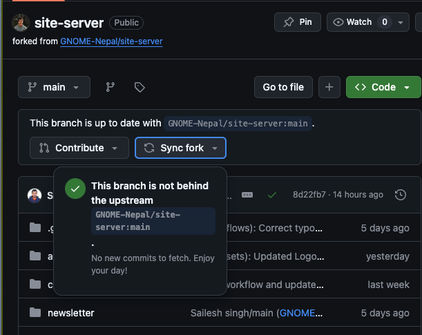

# Contributing to GNOME-Nepal

Thank you for showing an interest in contributing to GNOME-Nepal! All kinds of contributions are valuable to us. In this guide, we will cover how you can quickly onboard and make your first contribution.

## Table of Contents
- [Code of Conduct](#code-of-conduct)
- [How to Contribute](#how-to-contribute)
- [Getting Started](#getting-started)
- [Development Workflow](#development-workflow)
- [Submitting Changes](#submitting-changes)
- [Reporting Issues](#reporting-issues)
- [Style Guide](#style-guide)
- [Code Reviews](#code-reviews)
- [License](#license)

## Code of Conduct

Please read and adhere to our [Code of Conduct](CODE_OF_CONDUCT.md). By participating, you agree to abide by its terms.

## How to Contribute

You can contribute in several ways:
- [Reporting bugs](https://github.com/GNOME-Nepal/site-server/issues/new?assignees=rex9840%2Cn1rjal%2CSailesh-Singh&labels=bug&projects=&template=BUG-REPORT.yml)
- [Suggesting features](https://github.com/GNOME-Nepal/site-server/issues/new?assignees=rex9840%2Cn1rjal%2CSailesh-Singh&labels=feature%2Cenhancement%2Cquestion&projects=&template=FEATURE-REQUEST.yml)
- [Suggesting Enhancements and improvements](https://github.com/GNOME-Nepal/site-server/issues/new?assignees=rex9840%2Cn1rjal%2CSailesh-Singh&labels=enhancement%2Cquestion&projects=&template=IMPROVEMENTS.yml)
- Writing or improving documentation
- Submitting bug fixes or enhancements

## Getting Started

1. **Fork the repository:**
   [Click here to fork the repository](https://github.com/GNOME-Nepal/site-server/fork)


2. **Clone the forked repository:**
   ```bash
   git clone https://github.com/GNOME-Nepal/site-server.git
   cd site-server
   ```

3. **Setup env**

   Set up environment variables env by copying the env.example file and updating its entries to match your local settings.
   ```bash
   cp env.example .env
   ```

4. **Set up and source python virtual environment**
   ```bash
   python3 -m venv .venv
   source ./.venv/bin/activate
   ```

5. **Create a branch for your changes:**
   ```bash
   git checkout -b your-branch-name
   ```
## Development Workflow

1. **Keep your fork up to date:**
You can sync the fork using Github's UI



2. **Make your changes:**
   Implement your changes in the relevant files.

3. **Test your changes:**
    Ensure your changes work as intended and do not introduce new issues. Make sure that the Docker image thus created is runnable and doesn't cause further issues during build or in production.

4. **Lint your changes:**
    Inside the virtual environment, use the following commands
    ```
    python -m black . # Formats your code to meet our coding standards
    python -m flake8  # Identifies unused variables and linting issues
    ```

    Please note that our workflow will ignore your changes if it doesn't run or if linting is failing. If you need any help with that, feel free to create a PR and ask the help from maintainer.


5. **Commit your changes:**
   ```bash
   git add .
   git commit -m "Description of the changes"
   ```

6. **Push your changes:**
   ```bash
   git push origin your-branch-name
   ```

## Submitting Changes

1. **Create a Pull Request:**
   Go to the repository on GitHub and click the "New Pull Request" button. Follow the prompts to submit your pull request.

2. **Describe your changes:**
   Provide a detailed description of your changes, including the motivation behind them and any relevant issue numbers.

3. **Ensure all checks pass:**
   Make sure your pull request passes all automated checks and reviews.

## Reporting Issues

If you encounter any issues, please report them using the [Issue Tracker](https://github.com/GNOME-Nepal/site-server/issues). When reporting an issue, please include:
- A clear and descriptive title
- A detailed description of the problem
- Steps to reproduce the issue
- Any relevant logs or screenshots

## Style Guide

Please follow the project's style guide to ensure consistency. This includes code formatting, naming conventions, and documentation standards. Refer to the [Style Guide](STYLE_GUIDE.md) for more information.

## Code Reviews

All submissions, including pull requests, are reviewed. We aim to provide feedback within a reasonable timeframe. Contributions that do not align with the project's goals or guidelines may be rejected.

## License

By contributing, you agree that your contributions will be licensed under the project's [LICENSE](LICENSE).
